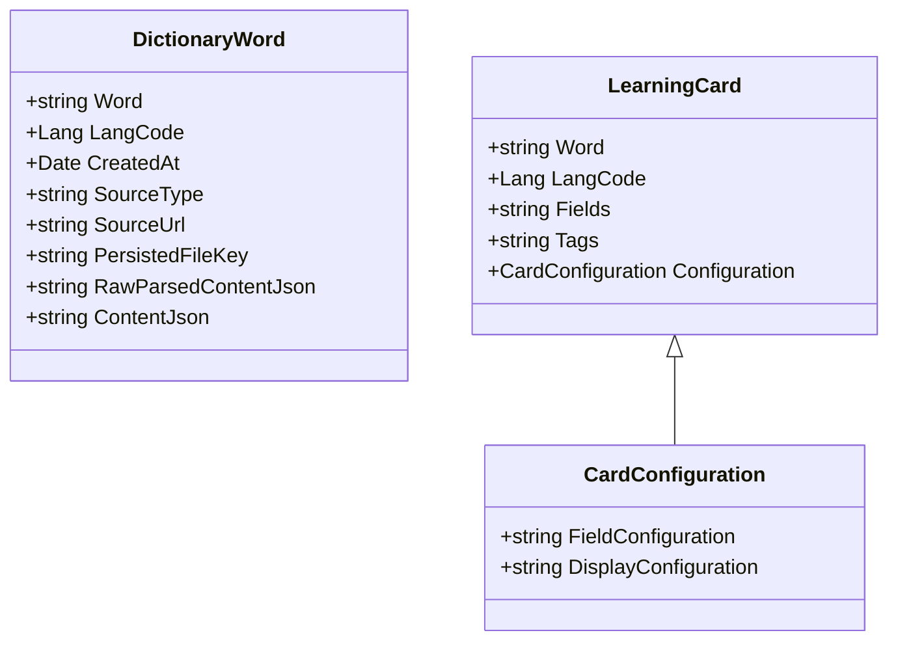

## Goals

The goals of the initial design is to port the existing tool to cloud. The commands that should be supported in `polanger` MVP:

- `search`
    - supports multiple languages
    - stores htmls in the cloud
    - stores parsed contents of htmls in the cloud
    - has an option to open up stored htmls
- `import`
    - imports searched words to anki allowing to specify the date period
- `open`
    - opens up a given word in the browser

Additional requirements:
- all existing words in the current tool should be ported to the new tool
- the new tools support wsjp and wiktionary for now, but should be easily extandable for new languages

## Model

